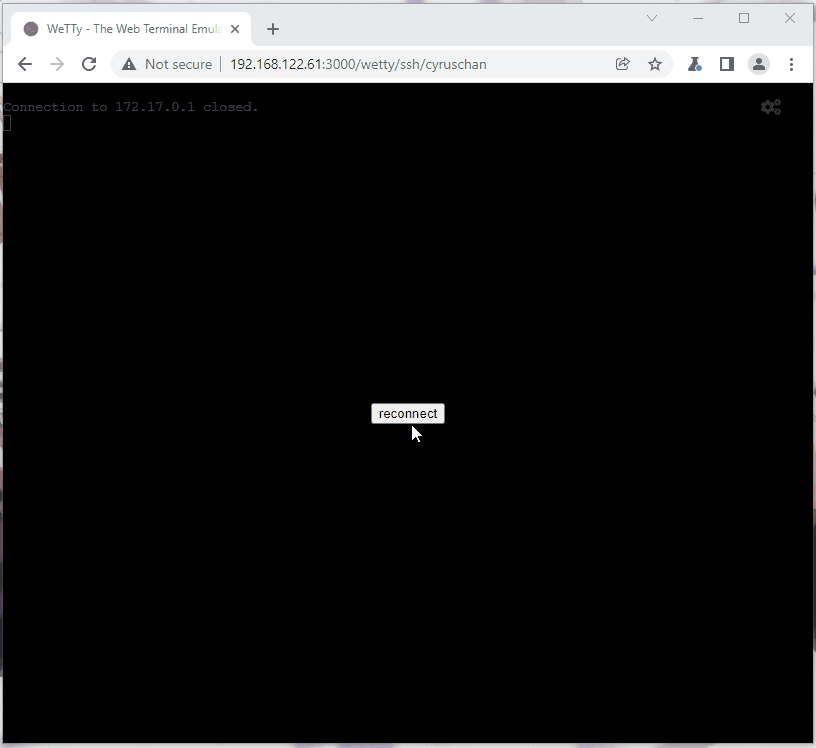
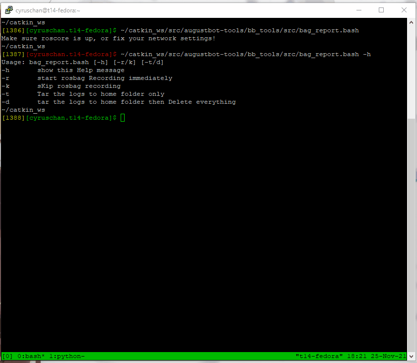

# README.md

This repo is a testground for debug tools (BoothBot-related).
As these are all python scripts, no dependency is listed in `package.xml` 
or `CMakeList.txt`. You have need a working `catkin_ws` to use this tools.

## TL;DR
```bash
# ROS/python setup
cd ~/catkin_ws/src && git clone git@gitee.com:august-robotics/augustbot-tools.git
cd augustbot-tools/bb-tools && python3 -m pip install -r requirements.txt
cd ~/catkin_ws && catkin_make # or catkin build
rosrun rosrun bb_tools dash.py 
```

## Tools

### `dash_v2.py`
- Displays the current state of the robot on terminal, subscribes to ROS topics.
- Usage: `rosrun rosrun bb_tools dash_v2.py `
- Optional web terminal setup:
  - 
    ```bash
    # Web terminal/docker
    docker pull wettyoss/wetty
    docker run --restart unless-stopped --detach --name wetty_pod -p 3000:3000 wettyoss/wetty --ssh-host=172.17.0.1\
    --ssh-user=augbooth --command="bash --rcfile <(echo '. ~/.bashrc; rosrun bb_tools dash_v2.py; exit')"
    ```
  - Then head to `http://<MACHINE-IP>:3000/wetty` and type your password
  - Preview:
    
    
### `bag_report.bash`
- Helper script to record rosbags and optionally pack all logs into a `.tar.gz`
- Usage: ` ~/catkin_ws/src/augustbot-tools/bb_tools/src/bag_report.bash -h`
- preview
  