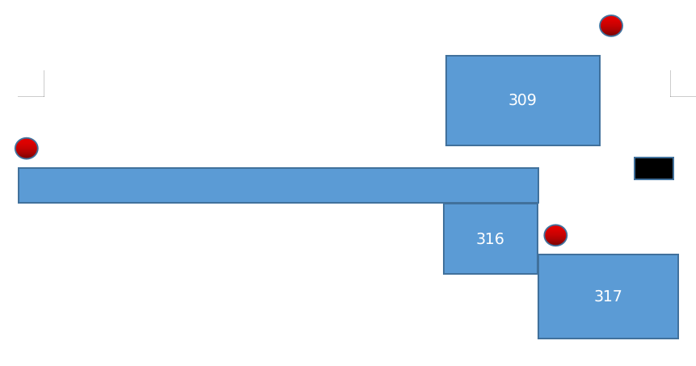

# GS aging steps

## Preparation

1. Place GS and 3 RBs in specified places.

2. Power on GS and RBs.

3. Prepare the aging code.

    ```bash
    ssh augbooth@gspx-00xx.local
    cd catkin_ws/src/augustbot-tools/
    git pull
    git checkout task-laser-on-gs-test
    ```

4. Modify aging info in this script.

    ```bash
    cd ~/catkin_ws/src/augustbot-tools/tools/scripts/tools/GS_aging
    ```

    Edit the script `GS_measurement_3RB_aging_m3rb.py`.  

    ```python

    # Modify as needed: this is RBs color.
    COLOR = "ROG"

    # Modify as needed: this is the pose we guessed gs. (x, y, rz(radian))
    GUESS_POSE = (0, 0.0, -1.45)

    # Modify as needed: these are the coordinates of RBs. more accurate is better.
    TEST_GOAL_0 = {"x": -15.54288662, "y": -1.659951443} 
    TEST_GOAL_1 = {"x": 2.445430569, "y": -48.48078833} 
    TEST_GOAL_2 = {"x": 8.566331757, "y": -3.244249486} 

    # Need not modify.
    goal_list = []
    goal_list.append(TEST_GOAL_0)
    goal_list.append(TEST_GOAL_1)
    goal_list.append(TEST_GOAL_2)

    # Modify as needed: TORLERANCE means the error of coordinate distance of two RBs and measurement distance of two RBs
    # If we cannot offer the accuracy of RB, tune bigger of this value(m). otherwise the calibration of two RBs would failed.
    TORLERANCE = 0.5

    # Modify as needed: there are the messages we guess where the RBs are.
    # Just modify the values of distance, rad_hor, rad_ver.
    M_TEST_GOAL_0 = gbmsgs.GBMeasureGoal(
        gid=1,
        color="ROG",
        distance=14.9,
        rad_hor=-1.59,
        rad_ver=-0.00,
        is_initialpose=False,
        unique_id=1,
    )

    M_TEST_GOAL_1 = gbmsgs.GBMeasureGoal(
        gid=1,
        color="ROG",
        distance=48.,
        rad_hor=-0.06,
        rad_ver=0.000,
        is_initialpose=False,
        unique_id=1,
    )

    M_TEST_GOAL_2 = gbmsgs.GBMeasureGoal(
        gid=1,
        color="ROG",
        distance=9,
        rad_hor=1.103,
        rad_ver=0.00,
        is_initialpose=False,
        unique_id=1,
    )
    ```

## Aging

5. Run the scripts

    ```bash
    cd ~/catkin_ws/src/augustbot-tools/tools/scripts/tools/GS_aging
    python GS_measurement_3RB_aging_m3rb.py
    ```

## Data

6. Get aging data from GS
    ```bash
    
    ```


# GS aging 测试流程

## 准备工作

- 将 RB 和 GS 放在下图相应位置

- 确认 GS 和本机处于相同网络

- 链接 GS：`ssh augbooth@gspx-00xx.local`
- `cd catkin_ws/src/boothbot/`
- `git checkout develop`
- `git pull`
- `cd catkin_ws/src/augustbot-tools/`
- `git checkout develop`
- `git pull`
- 切代码分支后，看情况是否要编译
- 如果要编译，输入命令 `build`，等待编译完成
- `tmux`
- `manual_mode`
- `roslaunch guiding_beacon_system guiding_station_main.launch`
- `ctrl+b` + `c` 新开 tmux 窗口
- 修改 `~/catkin_ws/src/augustbot-tools/tools/scripts/tools/GS_aging/GS_measurement_3RB_aging_m3rb.py`
- 修改代码里面的 `GUESS_POSE`，这个是 `GS` 的预估位置
- 修改 `COLOR`
- 修改 `TEST_GOAL_0`，`TEST_GOAL_1`, `TEST_GOAL_2`里面的 `x`, `y`的数据，这是 3 个 RB 的位置数据
- 修改 `M_TEST_GOAL_0`，`M_TEST_GOAL_2`，`M_TEST_GOAL_2`里面的 `distance`，`rad_hor`，`rad_ver` 里面的值。
- `cd ~/catkin_ws/src/augustbot-tools/tools/scripts/tools/GS_aging`
- `python GS_measurement_3RB_aging.py`
- 观察 GS 会对两个 RB 做标定，并对三个 RB 作测量，总共三组测试
- 实验完成后，将`~/catkin_ws/src/augustbot-tools/tools/scripts/tools/GS_aging` 下的 json 文件，复制到自己的电脑上
- `cd **/augustbot-tools/tools/scripts/tools/GS_aging` 进入自己电脑下的该文件夹，将 json 文件放置到该文件夹
- `python get_json_m3.py` 可以取得该次实验数据
