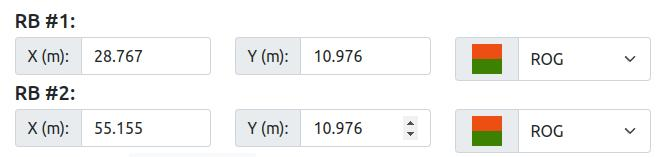
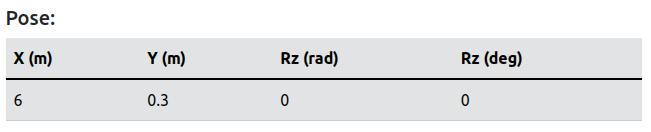
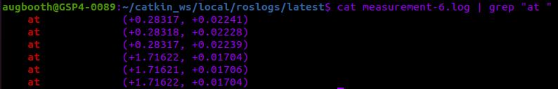
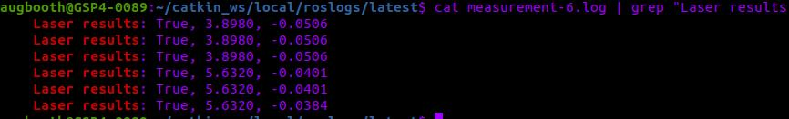
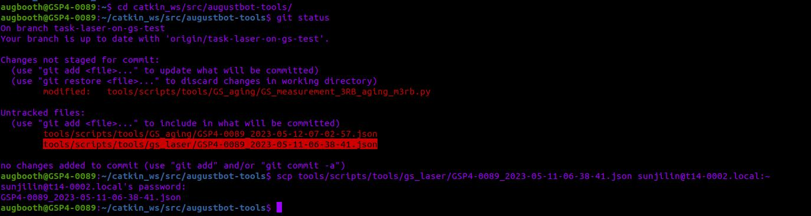
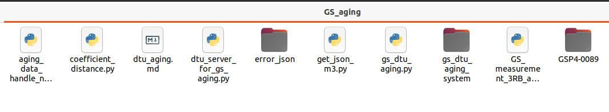
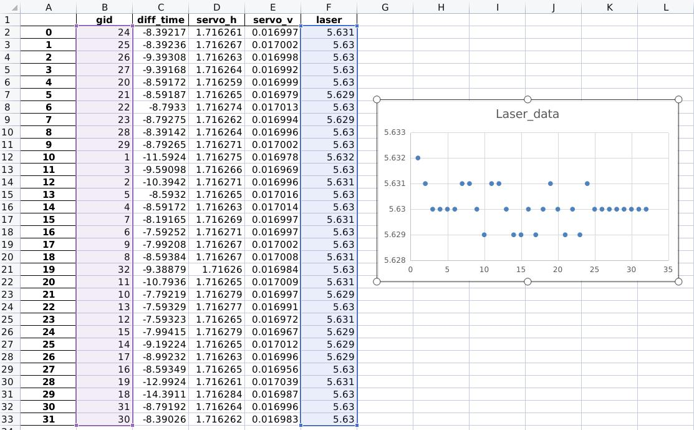

# GS aging steps

## Preparation

1. Place GS and 3 RBs in specified places.

2. Power on GS and RBs.

3. Do the `Auto Check Inclination`.

4. Option Step. Set the coordinate of two RBs on GS pages.  
    

    Do manual or auto cali once on GS.  
    If successed, we got the Pose of GS on Page. This pose can be set as GUESS_POSE in step 6.  
    

5. Option Step. If step 3 has been done, we can find more infomation in logs.

    ```bash
    cd catkin_ws/local/roslogs/latest
    ```

    ```bash
    cat measurement-6.log | grep "at "
    ```

      
    This values(groups of three, cause calibration would measure each rb three times) are the horizontal and vertical radian of RBs.  
    These can be set as rad_hor and rad_ver of M_TEST_GOAL_X in step 6.

    ```bash
    cat measurement-6.log | grep "Laser results"
    ```

    The first valuse is distance between GS and RB.  
    It can be set as of distance M_TEST_GOAL_X in step 6.  

    

6. Prepare the aging code.

    ```bash
    ssh augbooth@gspx-00xx.local
    cd catkin_ws/src/augustbot-tools/
    git pull
    git checkout task-laser-on-gs-test
    ```

4. Modify aging info in this script.

    ```bash
    cd ~/catkin_ws/src/augustbot-tools/tools/scripts/tools/GS_aging
    ```

    Edit the script `GS_measurement_3RB_aging_m3rb.py`.  

    ```python

    # Modify as needed: this is RBs color.
    COLOR = "ROG"

    # Modify as needed: this is the pose we guessed gs. (x, y, rz(radian))
    GUESS_POSE = (0, 0.0, -1.45)

    # Modify as needed: these are the coordinates of RBs. more accurate is better.
    TEST_GOAL_0 = {"x": -15.54288662, "y": -1.659951443} 
    TEST_GOAL_1 = {"x": 2.445430569, "y": -48.48078833} 
    TEST_GOAL_2 = {"x": 8.566331757, "y": -3.244249486} 

    # Need not modify.
    goal_list = []
    goal_list.append(TEST_GOAL_0)
    goal_list.append(TEST_GOAL_1)
    goal_list.append(TEST_GOAL_2)

    # Modify as needed: TORLERANCE means the error of coordinate distance of two RBs and measurement distance of two RBs
    # If we cannot offer the accuracy of RB, tune bigger of this value(m). otherwise the calibration of two RBs would failed.
    TORLERANCE = 0.5

    # Modify as needed: there are the messages we guess where the RBs are.
    # Just modify the values of distance, rad_hor, rad_ver.
    M_TEST_GOAL_0 = gbmsgs.GBMeasureGoal(
        gid=1,
        color="ROG",
        distance=14.9,
        rad_hor=-1.59,
        rad_ver=-0.00,
        is_initialpose=False,
        unique_id=1,
    )

    M_TEST_GOAL_1 = gbmsgs.GBMeasureGoal(
        gid=1,
        color="ROG",
        distance=48.,
        rad_hor=-0.06,
        rad_ver=0.000,
        is_initialpose=False,
        unique_id=1,
    )

    M_TEST_GOAL_2 = gbmsgs.GBMeasureGoal(
        gid=1,
        color="ROG",
        distance=9,
        rad_hor=1.103,
        rad_ver=0.00,
        is_initialpose=False,
        unique_id=1,
    )
    ```

## Aging

5. Run the scripts

    ```bash
    debug_shell
    cd ~/catkin_ws/src/augustbot-tools/tools/scripts/tools/GS_aging
    python GS_measurement_3RB_aging_m3rb.py
    ```

## Data

6. Get aging data from GS

    ```bash
    cd catkin_ws/src/augustbot-tools/
    ```

    Check aging json file in this repo.  
    Copy this file to our computer.

    ```bash
    scp tools/scripts/tools/GS_aging/GSP4-0089_2023-05-12-07-02-57.json sunjilin@t14-0002.local:~
    ```

    

7. Convert json file to excel file.

    copy json file to this diretory `augustbot-tools/tools/scripts/tools/GS_aging`
    Go to this diretory, run this script.

    ```bash
    python3 aging_data_handle_no_filter.py
    ```

8. Check aging data.

    We see there is a new folder name with GSP4-0089.  
    

    Open the excel file, we can check measurement of RBs in sheet `sp_1`, `sp_2`, `sp_3`.  
    `servo_h` means horizontal radian of GS.  
    `servo_v` means vertical radian of GS.  
    `laser` means distance between GS and RB.  
    
